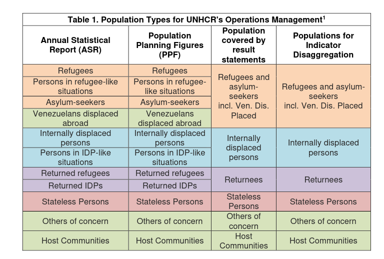

---
params:
  year: 2022
  region: "Europe"
title: "Result Based Management - Indicator Quality Assurance"
subtitle: "Regional Bureau `r params$region` | `r params$year`"
date: "`r format(Sys.Date(),  '%d %B %Y')`"
output:
  unhcrdown::docx_simple
---

```{r setup, include=FALSE}
## The region parameter should be one among 
#levels(as.factor(ForcedDisplacementStat::reference$UNHCRBureau))
# "Americas"    "Asia"        "EastAfrica"  "Europe"      "MENA"        "SouthAfrica" "WestAfrica" 

knitr::opts_chunk$set(echo = TRUE, fig.cap = TRUE, fig.width = 6.27)
library(officedown)
library(officer)
library(ggplot2)
library(readxl)


##  make sure to get last version of the data
if ( packageVersion("ForcedDisplacementStat") != "0.0.1"){pak::pkg_install("edouard-legoupil/ForcedDisplacementStat")}
library(ForcedDisplacementStat)

options(scipen = 999) # turn-off scientific notation like 1e+48
set.seed(1)
extrafont::loadfonts(quiet=TRUE)
```


```{r datapbi, message=FALSE, warning=FALSE, include=FALSE}
### Review in relation with the PBI extract
# https://app.powerbi.com/groups/me/apps/0970a707-7dbe-4a56-b90e-dbf0acde2ad5/reports/dc5ca004-8ce8-40fd-9858-59ac0e880f64/ReportSection097fb1a0b5b89c38a37f?ctid=e5c37981-6664-4134-8a0c-6543d2af80be

dataPBI <- readxl::read_excel(here::here("data","data_Result_Portal4.xlsx"), col_types = c("text", "text", "text", 
        "text", "text", "text", "text", "text", 
        "numeric", "text", "text", "text", 
        "text", "text", "text", "text", "text", 
        "text", "text", "text", "text", "numeric", 
        "text", "text", "text", "numeric", 
        "numeric", "numeric", "numeric", 
        "numeric", "numeric", "numeric", 
        "numeric", "numeric", "numeric", 
        "numeric", "numeric", "text", "text", 
        "text", "text", "text", "text", "text", 
        "text", "text", "text"),
                              sheet = "Export")

#names(dataPBI)

### Master file 
QA_Indic <- readxl::read_excel(here::here("data", "QA.xlsx"), 
                       sheet = "QA per Indicator", skip = 1) |>
  janitor::clean_names()

#names(QA_Indic)

data1  <- dataPBI |>
     dplyr::left_join(QA_Indic, by=c("Indicator_Code"= "indicator_code"))

```


```{r echo=FALSE, message=FALSE, warning=FALSE}
block_toc()
```

# Introduction: Quality Assurance Process 

## Population Data


COMPASS strategies include population information for different components (Population Statistics and Planning Figures; population covered by results statements; and populations for indicator disaggregation). Operations are requested to report on core impact and outcome indicators for all [population groups that exist in the country](https://intranet.unhcr.org/content/dam/unhcr/intranet/protection-operations/compass/en/guidance/4/Guidance%20Population%20Data%20FINAL.pdf). Other People in Need of International Protection (formerly VDAs) are automatically grouped together with Refugees and Asylum-Seekers when it comes to reporting indicators.  
 



Data can be extracted and summarized from the most recent public Statistical Report for each country (RAS: Refugees, Asylum Seekers and other Persons in needs of International Protection, IDP: Internally Displaced Person, STA: Stateless Persons, RET: Returnees and OOC: Other in needs of Concerns). These figures should align with the denominators in many of the core indicators, given that many indicators are intended to report on the protection and solutions situation on the entire population in the country. 

```{r echo=FALSE,  message=FALSE, warning=FALSE}
## Planning figure extracted from Compass
## https://unhcr-c1.board.com/#/screen/?capsulePath=RBM%20Planning%5CRBM%20Planning.bcps&screenId=19f6ec5a-5b48-4e37-9f0f-6a79f471a66c 
planningcompass <- readxl::read_excel(here::here("data","DataView.xlsx"), 
                                      sheet = "Layout 1")|>
                   janitor::clean_names( "lower_camel") |>
                   dplyr::filter( totalAssisted == "Total" ) |>
                  # dplyr::select(country, countryOfOrigin, populationTypeStatistical, x2022) |>
                  ## Creating the type used for Indicator reporting|>
           dplyr::mutate(populationIndicator = dplyr::case_when(
             populationTypeStatistical == "Asylum-Seekers" ~ "RAS",
             populationTypeStatistical == "Host Communities" ~ "HCT",
             populationTypeStatistical == "Internally Displaced Persons"   ~ "IDP",
             populationTypeStatistical == "Other People in need of International Protection" ~ "RAS",
             populationTypeStatistical == "Others of Concern" ~ "OOC",
             populationTypeStatistical == "Persons in IDP-like Situations" ~ "IDP",
             populationTypeStatistical == "Persons in refugee-like situations"  ~ "RAS",
             populationTypeStatistical == "Refugees"  ~ "RAS",
             populationTypeStatistical == "Returned IDPs"  ~ "RET",
             populationTypeStatistical == "Returned Refugees" ~ "RET",
             populationTypeStatistical == "Stateless" ~ "STA",
              TRUE ~ "" ) ) |>
           dplyr::group_by(country, populationIndicator )|>
           dplyr::summarise( ppf2022 = as.integer(sum(x2022, na.rm = TRUE)),
                             ppf2023 = as.integer(sum(x2023, na.rm = TRUE))) |>
           dplyr::ungroup() |>
           dplyr::mutate( keyPop = paste0(country, "_", populationIndicator)) |>
           dplyr::select(keyPop, ppf2022 , ppf2023)

#levels(as.factor(planningcompass$populationTypeStatistical))
 #  "Asylum-Seekers"    
 #  "Host Communities"                                
 #  "Internally Displaced Persons"  
 #  "Other People in need of International Protection"
 # "Others of Concern"              
 # "Persons in IDP-like Situations"    
 #   "Persons in refugee-like situations" 
 #   "Refugees"                                        
 #  "Returned IDPs"     
 #  "Returned Refugees"                               
 #  "Stateless"
```


```{r echo=FALSE,  message=FALSE, warning=FALSE}
## In order to create the comparison, we need to clean the default legal status coding that is not the same between the 3 corporate systems.. sigh...
compare <-  dplyr::left_join( x= ForcedDisplacementStat::end_year_population_totals_long, 
                              y= ForcedDisplacementStat::reference, 
                              by = c("CountryAsylumCode" = "iso_3")) |> 
           dplyr::filter( Year == 2022 )|>
           dplyr::filter( UNHCRBureau  == params$region )|>
           dplyr::group_by(UNHCRBureau, SUBREGION, ABCCode, ABCname, CountryAsylumCode, CountryAsylumName, Population.type.label)|>
           dplyr::summarise( asr2022 = sum(Value, na.rm = TRUE)) |>
           dplyr::mutate(populationIndicator = dplyr::case_when(
             Population.type.label == "Asylum seekers" ~  "RAS",
             Population.type.label == "Host community" ~  "HCT",
             Population.type.label == "Internally displaced persons" ~  "IDP",
             Population.type.label == "Other people in need of international protection"~  "RAS",
             Population.type.label == "Others of concern to UNHCR"  ~  "OOC",
             Population.type.label ==  "Refugees" ~  "RAS",
             Population.type.label ==  "Stateless Persons" ~  "STA",
                               TRUE ~ "Strange" ) ) |>
           dplyr::group_by(UNHCRBureau, SUBREGION, ABCCode, ABCname, CountryAsylumName, populationIndicator )|>
           dplyr::summarise( asr2022= as.integer(sum( asr2022, na.rm = TRUE)) ) |>
           dplyr::ungroup() |>
         ## Adjust a few country name for proper matching - Venezuela_  (Plurinational State of) 	United States of America
  
            dplyr::mutate(CountryAsylumName2 = stringr::str_replace(CountryAsylumName, " \\(Bolivarian Republic of\\)", ""),
                          CountryAsylumName2 = stringr::str_replace(CountryAsylumName2, " \\(Plurinational State of\\)", ""),
                          CountryAsylumName2 = stringr::str_replace(CountryAsylumName2, " of America", "")) |>
           dplyr::mutate( keyPop = paste0(CountryAsylumName2, "_", populationIndicator)) |>
  
           ## Now preparing PPF data           
          dplyr::left_join(planningcompass , by = c( "keyPop" )) |>
           dplyr::mutate( Operation = paste0(ABCCode, "/",CountryAsylumName)) |> 
          dplyr::select(UNHCRBureau, SUBREGION, Operation, populationIndicator, asr2022, ppf2022 , keyPop ) |>
          ## Calculation person     
          dplyr::mutate(change_PPF_ASR = paste0(round( (ppf2022- asr2022)/asr2022*100,1), " %"),
                         PPF_ASR =  ppf2022- asr2022 ) |>
          #dplyr::mutate(key2 =   paste0(Operation, "_",populationIndicator ) ) |>
          dplyr::mutate(Operation =  dplyr::if_else( is.na(PPF_ASR ), 
                                                     paste0(Operation, " -> No PPF"), 
                                                     paste0(Operation, " -> Planning ",
                                                     dplyr::if_else( PPF_ASR > 0, "+", ""), 
                                                     change_PPF_ASR) ) ) |>
          dplyr::filter( populationIndicator != "HCT")
          #tidyr::pivot_longer(cols = - Operation, populationIndicator)


# levels(as.factor(compare$Population.type.label))
#   "Asylum seekers"    
#   "Host community"                                  
#   "Internally displaced persons"   
#   "Other people in need of international protection"
#   "Others of concern to UNHCR"    
#   "Refugees"                                        
#  "Stateless Persons"


  cols_poptype <- c("RAS" = "#0072BC",
                    "OOC" = "#999999",
                    "IDP" = "#00B398",
                    "STA" = "#E1CC0D")


```

 

```{r echo=FALSE, fig.height=9, fig.width=6.5, message=FALSE, warning=FALSE}

subreg <- compare |>
          dplyr::select(  SUBREGION ) |>
          dplyr::filter( ! (is.na(SUBREGION)) ) |>
          dplyr::distinct() |>
          dplyr::pull()
  #  unique( as.character(compare$SUBREGION) )
if(length(subreg) > 0) {
for (sub in subreg ){
  #sub <- subreg[4]
  ## filter
  datacompare <- compare |> dplyr::filter(SUBREGION == sub & asr2022 > 1000)
  
  p <- ggplot(  data = datacompare) +
  geom_col(aes(  x  = asr2022/1e3, 
                 y = reorder(Operation, asr2022),
                 fill = populationIndicator),
           position = position_dodge(0.7),
           width = 0.3) +
  geom_col(aes(  x  = ppf2022/1e3, 
                 y = reorder(Operation,asr2022 ),
                 fill = populationIndicator),
           position = position_dodge(0.7),
           alpha = 0.6,
           width = 0.6) +
  facet_wrap(vars(populationIndicator), scales = "free") +
  scale_x_continuous(expand = expansion(c(0, 0.1))) +
  labs(title = "Reported (plain) & Planning Figures (transparent) | 2022",
       x = "Number of people (thousand)",
       subtitle = paste0("SubRegional Comparison ", sub),
       caption = "Source: UNHCR Refugee Data Finder & Compass - filter for Population type with more than 1000 ind.") +
  #unhcrthemes::scale_fill_unhcr_d(palette = "pal_unhcr") +
    scale_fill_manual(values = cols_poptype,
                      drop = TRUE,
                      limits = force) +
  unhcrthemes::theme_unhcr(grid = "X",
              axis = "y",
              axis_title = "x")
  
  print(p)
}
}


```


## Quality Assurance Framework 

Core indicator data must be quality assured by the Regional Bureau in relation to completeness, accuracy and consistency. In each section below you will see the criteria that should be used for this validation – defined by the Global Data Service.


### Completeness: 

 __Comp1.__ All mandatory core impact indicators and core outcome indicators from relevant outcome areas have been selected for all relevant population groups

 __Comp2.__ Values for baselines, targets and actuals have been entered for all selected indicators and all relevant population groups

 __Comp3.__ Appropriate means of verification have been selected - aka data source is not empty

 __Comp4.__ Data limitations have been recorded for each indicator, as applicable - when no data is provided, while that indicator was selected for that population group 

### Accuracy:

 __Acc1.__ Percentage indicators are correctly calculated, when both numerator and baseline

 __Acc2.__ Appropriate scales are used for text indicators. If a text unit, should be between 1 & 3

 __Acc3.__ Units of measurements are consistently used for baselines, actuals and targets. , if pecent between 0 & 100, if a number no denominator 

 __Acc4.__ The approach to missing values is correct, i.e., the use of “0” vs NA

 __Acc5.__ The relationship between baseline and target data is logical, e.g., targets are equal to or higher than the baselines

 __Acc6.__ The sum of disaggregated data, when available adds up to the totals for numeric indicators

 __Acc7.__ Possible erroneous values are identified based on the known situation in the country (e.g., the data entered seems plausible and outliers can be explained)

### Consistency: 

 __Cons1.__ The data and the narrative in the multi-year country strategy and/or the country annual results reports align, i.e., they tell the same story

 __Cons2.__ Multi-year budgets across years are consistent with planned indicator targets

 __Cons3.__ The results data (baseline, target, actual) is consistent with data that has been reported elsewhere in internal and external reports

 __Cons4.__ The results data (baseline, target, actual) is consistent with historical data from recent years

 __Cons5.__ Inconsistencies and contradictions are explained or can be explained


## Bureau Review 

```{r data, include=FALSE}

# Missing M&E Data sources
# Missing M&E Activity
# Missing Baseline
# Missing Baseline Numerator
# Missing Baseline Denominator
# Missing Actual
# Missing Actual Numerator
# Missing Actual Denominator
# Incorrect Baseline (i.e. >100%)
# Incorrect Actual (i.e. >100%)
# Baseline Higher (Lower) than Actual
# Significant Variance between Baseline and Actual (+/- 2*Baseline)
# Missing Data Limitation for Baseline
# Missing Data Limitation for Actual


### Lookup to get missing Country or Ops name in a consistent way 

t <- rbind( ForcedDisplacementStat::reference |>  
  dplyr::filter(OpType == "MC") |>
  dplyr::select(ABCCode, ABCname, OpType  ) |>
  dplyr::distinct(),
  ForcedDisplacementStat::reference |>  
    dplyr::filter(OpType == "ABC") |>
    dplyr::select(ABCCode, ABCname, OpType  ) |>
    dplyr::distinct())


#### QA and upload -- 
data <- data1 |>
  
  tidyr::unite(col =  "popmatch", 
               all_of( c("ABCCode", "sta", "idp", "ret", "ooc" ) ), 
               na.rm = TRUE, 
               sep = " ",
               remove = FALSE) |> 
  
  ## Fill Country
  dplyr::left_join( t, by= c("ABCCode")) |> 
  dplyr::filter( ! (is.na(ABCname))) |> 
  dplyr::filter(  Year == 2022 ) |> 
  dplyr::mutate(Country2 = ifelse( is.na(Country),ABCname, Country)) |>
  
  
#   table(data$Country2, useNA = "ifany")  
 
# table(data$ABCname, useNA = "ifany") 
# table(data |> 
#       dplyr::filter( is.na(ABCname)) |>
#       dplyr::pull(ABCCode)  , useNA = "ifany") 
# 
# GDS <- data |> 
#        dplyr::filter(  ABCCode == "GDS ABC")  |>
#        dplyr::select( Indicator, Reverse, Data_Sources) |> 
#        dplyr::distinct()
  
  ## Match with asr /ppf 
  dplyr::mutate(Country_rename = Country2) |>
  dplyr::mutate( Country_rename = stringr::str_replace(Country_rename, " \\(Bolivarian Republic of\\)", ""),
                Country_rename = stringr::str_replace(Country_rename, " \\(Plurinational State of\\)", ""),
                Country_rename = stringr::str_replace(Country_rename, " of America", ""),
                Country_rename = stringr::str_replace(Country_rename, "Congo, The Democratic Republic", "Democratic Republic of the Congo"),
                
                Country_rename = stringr::str_replace(Country_rename,  "Dem. Rep. of the Congo", "Democratic Republic of the Congo"),# 
               # Country_rename = stringr::str_replace(Country_rename, "ublic O", ". o") ,
                Country_rename = stringr::str_replace(Country_rename, "Iran (Islamic Rep. of)", "Iran (Islamic Republic of)") ,
                Country_rename = stringr::str_replace(Country_rename, "Iran (Islamic Republic Of)", "Iran (Islamic Republic of)") ,
               # Country_rename = stringr::str_replace(Country_rename, "Dominican Republic", "Dominican Republic") ,
                #Country_rename = stringr::str_replace(Country_rename, "ublic", "."),
                Country_rename = stringr::str_replace(Country_rename, "Turkiye", "Türkiye"), 
               Country_rename = stringr::str_replace(Country_rename, "Turkey", "Türkiye"),
                Country_rename = stringr::str_replace(Country_rename, "Cote D'Ivoire", "Côte d'Ivoire"),   
                Country_rename = stringr::str_replace(Country_rename,  "Cote d'Ivoire","Côte d'Ivoire"),
                Country_rename = stringr::str_replace(Country_rename, "Other -Kosovo", "Kosovo") ) |>  
  
  #   table(data$Country_rename, useNA = "ifany")
  ## Match for population group
  #   > levels(as.factor(data1$Population_Type ))
  # [1] "Host Community"              "IDPs"                       
  # [3] "None"                        "Others of Concern"          
  # [5] "Refugees and Asylum-seekers" "Returnees"                  
  # [7] "Stateless Persons"  
  dplyr::mutate(pType = dplyr::case_when(
    Population_Type == "Refugees and Asylum-seekers" ~ "RAS",
    Population_Type == "Host Community" ~ "HCT",
    Population_Type == "IDPs"   ~ "IDP",
    Population_Type == "Others of Concern" ~ "OOC",
    Population_Type == "Returnees"  ~ "RET",
    Population_Type == "Stateless Persons" ~ "STA",
    TRUE ~ "" ) ) |>
  dplyr::mutate(keyPop = paste0(Country_rename, "_", pType)) |>
  dplyr::left_join(compare,    by = c( "keyPop" ) )  |>
  ## Filter for the region
  dplyr::filter( UNHCRBureau  == params$region )|>
  
  ## Check no match
 # data |> 
 #   dplyr::filter( is.na(asr2022)) |> 
 #   dplyr::select(keyPop) |>
 #   dplyr::distinct() |>
 #   dplyr::arrange(keyPop) |>
 #   dplyr::pull()
 
  
  # table(data$asr2022, useNA = "ifany")
  # table(data$keyPop, useNA = "ifany")
  # table(data$Country_rename, useNA = "ifany")
  # table(data$Country, useNA = "ifany")
  # table(compare$keyPop, useNA = "ifany") 

  ## Match for population group
  dplyr::mutate( ras = as.character(ras),
                 sta = as.character(sta),
                 idp = as.character(idp),
                 ret = as.character(ret),
                 ooc = as.character(ooc),
                 ras = dplyr::if_else( ras == "1", "RAS", ras),
                 sta = dplyr::if_else( sta == "1", "STA", sta),
                 idp = dplyr::if_else( idp == "1", "IDP", idp),
                 ret = dplyr::if_else( ret == "1", "RET", ret),
                 ooc = dplyr::if_else( ooc == "1", "OOC", ooc)) |>
  
  tidyr::unite(col =  "popmatch", 
               all_of( c("ras", "sta", "idp", "ret", "ooc" ) ), 
               na.rm = TRUE, 
               sep = " ",
               remove = FALSE) |>
  
  ## Get all population type   "ras"   "sta"     "idp"     "ret"    "ooc"    
  
  ## Implement QA automatic Check
  dplyr::rename(  "Target_OP" = "Outcome_Target_or_Ouput_Target _OP" ) |>
  dplyr::mutate( Target_OP = as.numeric(Target_OP)) |>
  
  
  # __Comp1.__ All mandatory core impact indicators and core outcome indicators from relevant outcome areas have been selected for all relevant population groups
  dplyr::mutate(Comp1_1 = dplyr::if_else( is.na(Population_Type), "Missing Population Type", NA ),
                Comp1_2 = dplyr::if_else( !( is.na(Population_Type)) & 
                                            stringr::str_detect(Population_Type ,popmatch),
                                          "Population Type not matching indicator", NA ) ) |>
  
  # __Comp2.__ Values for baselines, targets and actuals have been entered for all selected indicators and all relevant population groups
  dplyr::mutate(Comp2_1 = dplyr::if_else( is.na(Actual), "Missing Actual", NA ),
                Comp2_2 = dplyr::if_else( is.na(Baseline), "Missing Baseline", NA ),
                Comp2_3 = dplyr::if_else( is.na(Target_OP) & Results_Level == "Outcome", "Missing Target", NA ) ) |>
  
  # __Comp3.__ Appropriate means of verification have been selected - aka data source is not empty
  dplyr::mutate(Comp3 = dplyr::if_else( is.na(Data_Sources), "Missing Data Source", NA ) ) |>
  
  # __Comp4.__ Data limitations have been recorded for each indicator, as applicable - when no data is provided, while that indicator was selected for that population group 
  dplyr::mutate(Comp4_1 = dplyr::if_else( is.na(Actual)   & 
                                          is.na(Actual_Data_Limitation) ,
                                        "Missing Data limitations on Actual while there's no data", NA ) ) |>
  dplyr::mutate(Comp4_2 = dplyr::if_else( is.na(Actual)   & 
                                            is.na(Baseline_Data_Limitation) ,
                                          "Missing Data limitations on Baseline while there's no data", NA ) ) |> 
  
  # __Acc1.__ Percentage indicators are correctly calculated, when both numerator and baseline
  dplyr::mutate(Acc1_1 = dplyr::if_else( Show_As == "Percent"   & 
                                           is.na(Actual_Numerator) ,
                                         "Numerator for Actual is missing", NA ),
                Acc1_2 = dplyr::if_else( Show_As == "Percent"   & 
                                           is.na(Actual_Denominator) ,
                                         "Denominator for Actual is missing", NA ),
                Acc1_3 = dplyr::if_else( Show_As == "Percent"   & 
                                           !( is.na(Actual_Denominator)& 
                                                is.na(Actual_Numerator) & 
                                                is.na(Actual)) &
                                           round(Actual,0) != round((Actual_Numerator/Actual_Denominator *100),0),
                                         "Percentage Calculation for Actual is not correct", NA ),
                Acc1_4 = dplyr::if_else( Show_As == "Percent"   & 
                                           is.na(Baseline_Numerator) ,
                                         "Numerator for baseline is missing", NA ),
                Acc1_5 = dplyr::if_else( Show_As == "Percent"   & 
                                           is.na(Baseline_Denominator) ,
                                         "Denominator for baseline is missing", NA ),
                Acc1_6 = dplyr::if_else( Show_As == "Percent"   & 
                                           !( is.na(Baseline_Denominator)& 
                                                is.na(Baseline_Numerator) & 
                                                is.na(Baseline)) &
                                           round(Baseline,0) != round((Baseline_Numerator/Baseline_Denominator *100),0),
                                         "Percentage Calculation for baseline is not correct", NA ) ) |> 
  
  # __Acc2.__ Appropriate scales are used for text indicators. If a text unit, should be between 1 & 3
  dplyr::mutate(Acc2_1 = dplyr::if_else( Show_As == "Text"   &  
                                           !( is.na(Actual)) &
                                           !( Actual %in% c(1,2,3)) ,
                                         "Appropriate scales is not used for actual text indicators", NA ),
                Acc2_2 = dplyr::if_else( Show_As == "Text"   & 
                                           !( is.na(Baseline)) &
                                           !( Baseline %in% c(1,2,3)) ,
                                         "Appropriate scales is not used for baseline text indicators", NA ) ) |> 
  
  # __Acc3.__ Units of measurements are consistently used for baselines, actuals and targets. , if pecent between 0 & 100, if a number no denominator 
  dplyr::mutate(Acc3_1 = dplyr::if_else( Show_As == "Percent"   &  
                                           !( is.na(Actual)) &
                                           ( Actual < 0 | Actual >100) ,
                                         "Appropriate scales is not used for actual percent indicators", NA ),
                Acc3_2 = dplyr::if_else( Show_As == "Percent"   & 
                                           !( is.na(Baseline)) &
                                           ( Baseline <0 | Baseline >100) ,
                                         "Appropriate scales is not used for baseline percent indicators", NA ) ) |> 
  
  # __Acc4.__ The approach to missing values is correct, i.e., the use of “0” vs NA
  
  # __Acc5.__ The relationship between baseline and target data is logical, e.g., targets are equal to or higher than the baselines
  dplyr::mutate(Acc5_1 = dplyr::if_else( standard_direction == "more_or_equal"   &  
                                           Results_Level == "Outcome" &
                                           !( is.na(Baseline)) & 
                                           !( is.na(Target_OP)) &
                                           Target_OP < Baseline ,
                                         "Target value is below the baseline", NA ) ,
                Acc5_2 = dplyr::if_else( standard_direction == "less_or_equal"   &  
                                           Results_Level == "Outcome" & 
                                           !( is.na(Baseline)) & 
                                           !( is.na(Target_OP)) &
                                           Target_OP > Baseline ,
                                         "Target value is above the baseline", NA ) ,
                Acc5_3 = dplyr::if_else( standard_direction == "more_or_equal"   &  
                                           Results_Level == "Outcome" & 
                                           !( is.na(threshold_green)) & 
                                           !( is.na(Target_OP)) &
                                           Target_OP < threshold_green ,
                                         "Target value is below acceptable standard", NA ) ,
                Acc5_4 = dplyr::if_else( standard_direction == "less_or_equal"   &  
                                           Results_Level == "Outcome" & 
                                           !( is.na(threshold_green)) & 
                                           !( is.na(Target_OP)) &
                                           Target_OP > threshold_green ,
                                         "Target value is above acceptable standard", NA )  )   |>
  
  # __Cons1.__ Detect strange issue
  dplyr::mutate(Cons1_1 = dplyr::if_else( Show_As == "Percent"    &  
                                            Results_Level == "Outcome" &
                                            !( is.na(Baseline)) & 
                                            !( is.na(Target_OP)) &
                                            abs(Target_OP - Baseline) > 40 ,
                                          "More than 40% difference between Target and Baseline", NA ) ,
                Cons1_2 = dplyr::if_else( Show_As == "Percent"  & 
                                            !( is.na(Baseline)) & 
                                            !( is.na(Actual)) &
                                            abs(Actual - Baseline) > 40 ,
                                          "More than 20% difference between Actual and Baseline", NA ) ,
                Cons1_3 = dplyr::if_else( Show_As == "Percent"   & 
                                            !( is.na(Baseline_Denominator) ) &
                                            !( is.na(asr2022)) &
                                            Baseline_Denominator > asr2022 ,
                                          "Baseline Denominator is superior to last public release of ASR data", NA ) ,
                Cons1_4 = dplyr::if_else( Show_As == "Percent"   & 
                                            !( is.na(Actual_Denominator) ) &
                                            !( is.na(asr2022)) &
                                            Actual_Denominator > asr2022 ,
                                          "Actual Denominator is superior to last public release of ASR data", NA )  )   |>
  
  
  ## Summary QA
  tidyr::unite(col =  "QA_logical", 
               all_of( c("Comp1_1","Comp1_2",
                         "Comp2_1","Comp2_2","Comp2_3", 
                         "Comp3",
                         "Comp4_1","Comp4_2",
                         "Acc1_1","Acc1_2","Acc1_3",
                         "Acc1_4","Acc1_5","Acc1_6",
                         "Acc2_1","Acc2_2",  
                         "Acc3_1","Acc3_2", 
                         "Acc5_1","Acc5_2","Acc5_3","Acc5_4", 
                         "Cons1_1","Cons1_2","Cons1_3","Cons1_4" ) ), 
               na.rm = TRUE, 
               sep = " - ",
               remove = FALSE) 

#names(data)
# t <- as.data.frame(table( data$QA_logical, useNA = "ifany"))
# 
# write.csv(t,here::here("data","QACheck.csv"), row.names = FALSE)
```


### Summary of automatic check


The full list of implemented automatic check output is below


```{r echo=FALSE, fig.height=7, fig.width=6.5, message=FALSE, warning=FALSE}
checklist <- c("Comp1_1","Comp1_2",
               "Comp2_1","Comp2_2","Comp2_3", 
               "Comp3",
               "Comp4_1","Comp4_2",
               "Acc1_1","Acc1_2","Acc1_3",
               "Acc1_4","Acc1_5","Acc1_6",
               "Acc2_1","Acc2_2",  
               "Acc3_1","Acc3_2", 
               "Acc5_1","Acc5_2","Acc5_3","Acc5_4", 
               "Cons1_1","Cons1_2","Cons1_3","Cons1_4")      
summary0 <- data.frame( Var1=character(),
                        Var2=character(),
                        Freq=double(),
                        stringsAsFactors=FALSE)    

for (check in  checklist) {
  #check <- checklist[1]
  datacheck <- data |>
               dplyr::select (ABCCode, any_of(check) )
  
  thischeck <- round(prop.table(table( datacheck[[1]], datacheck[[2]], useNA = "ifany"), margin=1)* 100 , 1) |> 
    as.data.frame()|>
    dplyr::filter( !(is.na(Var2)))
  
  summary0 <-rbind(summary0, thischeck) 
}

summary0    |>
  dplyr::filter(Freq > 0) |>
  ggplot(  aes(x = Var1, 
               y = Var2, 
               fill = Freq)) +
  geom_tile(color = "white",
            lwd = 1.5,
            linetype = 1) +
  coord_fixed() +
  geom_text(aes(label = Freq), color = "grey25", size = 2) + 
  scale_y_discrete(labels = scales::label_wrap(50)) + 
  #scale_fill_gradient2(low = "#069C56",    mid = "#FF980E",   high = "#D3212C") +
  scale_fill_gradientn(colors = hcl.colors(7,  palette = "viridis", alpha = 0.6, rev = TRUE)) +
  coord_fixed() +
  unhcrthemes::theme_unhcr(font_size = 13, 
                           rel_small = 5/9,
                           grid = FALSE, 
                           axis = FALSE) +
  theme(legend.position = "none", 
        axis.text.x = element_text(angle = 45, hjust = 1, vjust = 0.5) ) +
  labs( x = "", y =  "" ,
        title = stringr::str_wrap( paste0("RBM Systematic Quality Check: % of indicator with issues") , 60),
        subtitle = stringr::str_wrap( paste0("Regional Comparison", params$region , " | 2022 Quality Assurance" ) ,
                                      80),
        caption = "Source: UNHCR RBM / Compass ")
```

\newpage

The table below summarizes the main issues

```{r echo=FALSE, fig.height=7, fig.width=6.5, message=FALSE, warning=FALSE}
## other summary as per DPSR
summary <- rbind(   
#% of 2022 actuals available
#Comp2_1 = dplyr::if_else( is.na(actual_2022_percent), "Missing Actual", NA ),  
  round(prop.table(table( data$ABCCode, data$Comp2_1, useNA = "ifany"), margin=1)* 100 , 1) |> 
                as.data.frame()|>
                dplyr::filter( !(is.na(Var2))),
# % of baselines available
#Comp2_2 = dplyr::if_else( is.na(baseline_2022_percent), "Missing Baseline", NA ),
              round(prop.table(table( data$ABCCode, data$Comp2_2, useNA = "ifany"), margin=1)* 100 , 1) |> 
                as.data.frame()|>
                dplyr::filter( !(is.na(Var2))),
#% of targets available
#Comp2_3 = dplyr::if_else( is.na(op_target_2022) & results_level == "Outcome", "Missing Target", NA ) ) |>
              round(prop.table(table( data$ABCCode, data$Comp2_3, useNA = "ifany"), margin=1)* 100 , 1) |> 
                as.data.frame()|>
                dplyr::filter( !(is.na(Var2)))  )  |>
          dplyr::mutate(Assess = dplyr::case_when(
             Var2 == "Missing Actual" ~ "% of 2022 actuals available",
             Var2 == "Missing Baseline" ~ "% of baselines available",
             Var2 == "Missing Target" ~ "% of targets available",
              TRUE ~ "" ) ) |>
  dplyr::mutate(Value = 100 - Freq  ) |>
  dplyr::rename(Plan = Var1 ) |>
  dplyr::select( Plan, Assess, Value) |>
  tidyr::pivot_wider(names_from = Assess, values_from = Value) |>
  dplyr::select("Plan",
                "% of baselines available",
                "% of targets available",	
                "% of 2022 actuals available" ) 
library(tidyverse)
summary <- summary %>%
  ungroup   %>%
 # add_row(year = 'mean', !!! colMeans(.[-1]))  
  reframe(Plan = c(as.character(Plan), 'Regional Average'),
            across(where(is.numeric), ~ c(., mean(.))))
  

ft_2 <- flextable::flextable( summary )
ft_2 <- flextable::bg(ft_2, bg = "grey95", part = "header")
ft_2  <- flextable::width(ft_2 , width = 1)
colourer <- scales::col_numeric( palette = "RdYlBu", domain = c(0, 100) )
ft_2 <- flextable::bg(ft_2, j = c(2:4),    bg = colourer, part = "body"  )
ft_2 
 


```


### A visual Tool for Regional Review

In order to facilitate a quick regional review, the review includes,  for each indicator, a summary chart together with a table outlining:  

 * Actual value with generated logical validation warning and feedback when required (concatenating: __Comp1, Comp2, Comp3, Acc1, Acc2, Acc3, Acc5__)  
 
 * Existing Data Limitation ( __Acc4, Cons5__)
 
 * Missing data ( __Comp4__) for indicator that were selected and not data limitation was provided.
 
The table only includes indicators that have been included in the Monitoring  & Evaluation Plan. 

The charts are called "__bullet graph__"; they are a variation of a regular bar graph inspired by the traditional "thermometer charts" (_are we good?_) and progress bars (_are we progressing?_). This type of visualization allows to represent as multiple nested bars the different values of the indicators (baseline 2022 and current 2022) for all the different countries and population group to be compared. The dark center line represents the actual value, the dark vertical line represents the baseline value an the the colored bands represent standard ranges extracted from the [indicator metadata](https://intranet.unhcr.org/content/dam/unhcr/intranet/protection-operations/compass/en/guidance/3/coreindicatorsmetadata/2.0%20Core%20Indicator%20Metadata%2004%2010%202021.pdf), i.e. acceptable /green, unacceptable/ orange & critical/red. The labels for the countries includes, for outcome what percentage of the total budget for the operation was spent on the outcome and some background in relation with the data source. 

Indicators are grouped together in relation with technical area of expertise within the bureau: 

 * Protection / Legal ( Access to Territory, Non-refoulement; Complementary Pathways; Freedom of Movement; Statelessness; Law & Policy)
 
 * Protection  / thematic ( Gender-Based Violence; Child Protection; Education; Community-Based Protection; Accountability to Affected Populations)
 
 * Protection / case management (Registration; Refugee Status Determination; Resettlement; Documentation; Voluntary Repatriation)
 
 * Assistance & Inclusion (Basic Needs; Health;  Shelter; Water, Sanitation & Hygiene; Energy; Security; Livelihoods & Economic Inclusion; Social Protection)
 
 
 

A visual inspection of the charts provides technical experts a quick check the remaining dimensions ( __Cons1, Cons2, Cons3, Cons4, Acc4, Acc7__).

Experts are then providing in a dedicated text box for each indicator with one bullet point per country/population type, spotting potential erroneous values and inconsistencies in the reported one. This document can be edited online and through the browser in order to have different people working on it at the same time.


```{r echo=FALSE, fig.height=7, fig.width=6.5, message=FALSE, warning=FALSE}
# data |>
#   dplyr::select(operation,  actual, baseline,target, threshold_red, threshold_orange, threshold_green  ) |>
#  # dplyr::mutate( target = baseline + 20) |>
#   dplyr::mutate( explain = paste0("Explanation note about the data used for ", operation )) |>
#   dplyr::select(operation, explain, actual, baseline,target, threshold_red, threshold_orange, threshold_green ) |>
# 
#   datapasta::dpasta()

dataplot <- tibble::tribble(
  ~operation,                                             ~explain, ~actual, ~baseline, ~target, ~threshold_red, ~threshold_orange, ~threshold_green,
  "Honduras",  "Data source is the national HH",      53,        55,      58,             17,                38,               59,
  "Guatemala", "Data source is the national HH",      43,        49,      60,             17,                38,               59,
  "Mexico",    "Data source is the national HH",      41,        43,      50,             17,                38,               59,
  "Colombia",  "Data source is the national HH",      40,        32,      52,             17,                38,               59,
  "Peru",      "Data source is the national HH",      40,        44,      64,             17,                38,               59,
  "Ecuador",   "Data source is the national HH",      38,        28,      48,             17,                38,               59,
  "Panama",    "Data source is the national HH",      38,        28,      48,             17,                38,               59,
  "Brazil",    "Data source is the national HH",      33,        26,      46,             17,                38,               59,
  "USA",    "Data source is the national HH",      37,        26,      46,             17,                38,               59,
  "Canada",    "Data source is the national HH",   23,        26,      46,             17,                38,               59,
  "Venezuela",   "Data source is the national HH", 13,        26,      46,             17,                38,               59,
  "El Salvador",  "Data source is the national HH",   32,        26,      46,             17,                38,               59,
  "Argentina",   "Data source is the national HH", 45,        26,      46,             17,                38,               59,
  "Chile",     "Data source is the national HH",   42,        26,      46,             17,                38,               59
                          )

dataplot1 <- dataplot |>
  dplyr::mutate( operation = glue::glue("<b>{operation}</b><br> <i>({explain})</i>"),
                 operation = forcats::fct_reorder(operation, actual))

maxgreen <- max(dataplot$threshold_green)
maxorange <- max(dataplot$threshold_orange)
maxred <- max(dataplot$threshold_red)
nline <- nrow(dataplot)

ggplot(  data = dataplot1 ) +
  geom_col( aes(x = reorder(operation, actual) , y = threshold_green),
    fill = "#069C56", width = 0.6, alpha = 0.4  ) +
  geom_col( aes(x = reorder(operation, actual), y = threshold_orange),
    fill = "#FF980E", width = 0.6,  alpha = 0.4 ) +
  geom_col(  aes(x = reorder(operation, actual), y = threshold_red),
    fill = "#D3212C", width = 0.6, alpha = 0.4 ) +
  geom_errorbar(  aes(x = reorder(operation, actual), ymin = baseline, ymax = baseline),
    color = "black",  width = 0.45,  size = 1) +
  geom_errorbar(  aes(x = reorder(operation, actual), ymin = target, ymax = target),
    color = "white",  width = 0.45, size = 1  ) +
  geom_col(   aes(x = reorder(operation, actual), y = actual),
    fill = "#0072BC",  color = NA,  width = 0.2 ) + 
  geom_text(aes(x = reorder(operation, actual), y = actual,
                label = round(actual, 2)),
            hjust = 1.5, size = 3,color = "white") + 
  # geom_label(aes(x = reorder(operation, actual), y = max(data$threshold_green),
  #               label = stringr::str_wrap( explain, 50) ), hjust = 0, size = 3) +
  coord_flip() +
  annotate( "text",
             x = c(rep((nline + .45), 3)),
             y = c(
                maxred * 0.5,
                maxorange * 0.75,
                maxgreen * 0.8  ),
    label = c("Critical", "Unacceptable", "Acceptable"),
    color = c(rep("grey25", 3))
  ) +
  scale_y_continuous(breaks = seq(0, 100, 20),
                     limits = c(0, maxgreen)) +  
  #scale_x_discrete(labels = scales::label_wrap(30)) +
  unhcrthemes::theme_unhcr(font_size = 12, grid = "X", axis = "y") +
  theme(  axis.text.y = ggtext::element_markdown()) +
  labs(
    x = "",
    y = "\n (as Percent) Actual value = horizontal  blue line. \n Baseline = black vertical line | Target = vertical white line",
    title = stringr::str_wrap("RBM Indicator :  -- Example of bullet chart -- ", 60),
    subtitle = stringr::str_wrap("Below is an illustrative example of an ideal bullet chart: We have values for actual, target and baseline, the value are consistent with the indicator direction, data source is documented...", 80),
    caption = "Source: Dummy data for illustrative purpose and data literacy development!")  


```


```{r echo=FALSE, message=FALSE, warning=FALSE}
#' @title Generate a bullet chart for quick quality assurance
#' @description ## https://datavizcatalogue.com/methods/bullet_graph.html
#'   In a Bullet Graph, the main data value is encoded by length with the bar in the 
#'  centre of the chart, which is known as the Feature Measure. The line marker that 
#'  runs perpendicular to the orientation of the graph is known as the Comparative 
#'  Measure and is used as a target marker to compare against the Feature Measure 
#'  value. So if the main bar has passed the position of Comparative Measure, you 
#'  know you've hit your goal.

#'  The segmented coloured bars behind the Feature Measure are used to display 
#'  qualitative range scores. Each colour shade (the three shades of grey in the
#'  example above) are used to assign a performance range rating. So for example,
#'  poor, average and great. When using Bullet Graphs, it's ideal to keep the 
#'  maximum number of performance ranges to five. 
#'
#' @param data RBM QA dataset - expect a few pre-defined variables to works well..
#' @param thisind wich indicator to chart
#'
#' @importFrom unhcrthemes theme_unhcr
#'
#' @return frame with all compass indicators
#' 
#' @export
#'
rbm_bullet <- function(data, thisind){
  thisdata1 <- data |>
  dplyr::filter(ind_id == thisind) |>
  dplyr::mutate(Country2 = stringr::str_replace(Country2, " \\(Bolivarian Republic of\\)", "")) |>
  dplyr::distinct() |>
  dplyr::mutate(Additional_Data_Sources = stringr::str_replace_all(Additional_Data_Sources,
                                                                  "https://", " " ) ) |>
  dplyr::rename(target = Target_OP, 
                baseline = Baseline, 
                actual = Actual ) |>  
  dplyr::mutate(Additional_Data_Sources = substr(Additional_Data_Sources, 0 , 50)) |>
  tidyr::unite(col =  "data_info", 
               all_of( c("Data_Sources", "Additional_Data_Sources") ), 
               na.rm = TRUE, 
               sep = "<br> ",
               remove = FALSE) |>
  ## Trying to sanitize to get rid of..
  ## Error: gridtext has encountered a tag that isn't supported yet: <a>
  # Only a very limited number of tags are currently supported.
  
  dplyr::mutate(data_info = stringr::str_replace_all(data_info, "https://", " " ) ) |>
  dplyr::mutate(data_info = stringr::str_replace_all(data_info, "www.", " " ) ) |>
  
  dplyr::mutate( group = as.character(glue::glue("{Country2}/{Population_Type}") ) ) |>
  dplyr::mutate( operation = as.character(glue::glue("<b>{Country2}/{Population_Type}</b><br> <i>({data_info} )</i>") ) ) |>
  #dplyr::arrange(desc(actual))
  dplyr::group_by(Country2) |>
  dplyr::arrange(desc( actual), .by_group=TRUE ) |> 
  dplyr::ungroup(Country2) 

## We keep only when there's value for plotting!
thisdata <- thisdata1   |>
  dplyr::filter( !(is.na(actual))) 
#thisdata$operation

nline <- nrow(thisdata)
indname <- thisdata |>
  dplyr::distinct(Indicator) |>
  dplyr::pull()
standard_direction <- thisdata |>
  dplyr::distinct(standard_direction) |>
  dplyr::pull()
reverse <- thisdata |>
  dplyr::distinct(reverse) |>
  dplyr::pull()
show_as <- thisdata |>
  dplyr::distinct(Show_As) |>
  dplyr::pull()
area <- thisdata |>
  dplyr::distinct(area) |>
  dplyr::pull()
## levels(as.factor(data$results_level))
results_level <- thisdata |>
  dplyr::distinct(results_level) |>
  dplyr::pull()


## case there's no data at all 

if( nrow(thisdata) == 0) {
  info <-  paste0("There\'s no recorded indicator value \n", thisind)
  p <- ggplot() +  annotate("text",  x = 1, y = 1, size = 12,  
                            label = info ) +  theme_void() 
  
} else if(nrow(thisdata)> 0) {
  ## and now the plot
  p <- ggplot(  data = thisdata ) +
    coord_flip() 
  
  ## Background with color band! 
  if( standard_direction == "more_or_equal") {
    maxgreen <- max(thisdata$threshold_green)
    maxorange <- max(thisdata$threshold_orange)
    maxred <- max(thisdata$threshold_red)
    yaxistext <- paste0("\n (as ", show_as, ") Actual value = horizontal blue line. \n Baseline = black vertical line | Target = vertical grey line")
    p <- p +
      geom_col( aes(x = reorder(operation, actual) , y = threshold_green),
                fill = "#069C56", width = 0.6, alpha = 0.4  ) +
      geom_col( aes(x = reorder(operation, actual), y = threshold_orange),
                fill = "#FF980E", width = 0.6,  alpha = 0.4 ) +
      geom_col(  aes(x = reorder(operation, actual), y = threshold_red),
                 fill = "#D3212C", width = 0.6, alpha = 0.4 )
  }  else if ( standard_direction == "less_or_equal") { 
    
    maxgreen <- max(thisdata$threshold_green)
    maxorange <- max(thisdata$threshold_orange)
    maxred <- max(thisdata$threshold_red)
    yaxistext <- paste0("\n (as ", show_as, ") Actual value = horizontal blue line. \n Baseline = black vertical line | Target = vertical grey line")
    p <- p   +
      geom_col(  aes(x = reorder(operation, actual), y = threshold_red),
                 fill = "#D3212C", width = 0.6, alpha = 0.4 )+
      geom_col( aes(x = reorder(operation, actual), y = threshold_orange),
                fill = "#FF980E", width = 0.6,  alpha = 0.4 )+
      geom_col( aes(x = reorder(operation, actual) , y = threshold_green),
                fill = "#069C56", width = 0.6, alpha = 0.4  )
  }
  
  p <- p  +
    geom_errorbar(  aes(x = reorder(operation, actual), ymin = baseline, ymax = baseline),
                    color = "black",  width = 0.45,  linewidth = 1) 
  
  ## Add the target and change the color based on the context
  if( results_level == "Outcome" & standard_direction == "No_standard") { 
    p <- p  +
      geom_errorbar(  aes(x = reorder(operation, actual), ymin = target, ymax = target),
                      color = "grey50",  width = 0.45, linewidth = 1  ) 
  }   else  if ( results_level == "Outcome" & standard_direction != "No_standard"){  
    p <- p  +
      geom_errorbar(  aes(x = reorder(operation, actual), ymin = target, ymax = target),
                      color = "white",  width = 0.45, linewidth = 1  )    }     else { }
  
  p <- p  +
    geom_col(   aes(x = reorder(operation, actual), y = actual),
                fill = "#0072BC",  color = NA,  width = 0.2 ) + 
    geom_text(aes(x = reorder(operation, actual), y = actual,
                  label = round(actual, 1)),
              hjust = 1.5, size = 3,color = "white") 
  
  ## Change scale based on unit!
  if( show_as == "Percent") {
    p <- p +
      # scale_y_continuous( label = scales::label_percent(accuracy = 0,
      #                                 suffix = "%") ) 
      scale_y_continuous( label =  scales::label_number(accuracy = 1,  
                                                        scale_cut = scales::cut_short_scale()) )
  } else {
    p <- p +
      scale_y_continuous( label =  scales::label_number(accuracy = 1,  
                                                        scale_cut = scales::cut_short_scale()) )
  }  
  
  ## Build the axis explanation -- accounting for the unit - 
  # and for the existence of a target in case the indicator is an ooutcome   
  if( results_level == "Outcome" & standard_direction != "No_standard") {
    yaxistext <- paste0("\n (as ",
                        show_as,
                        ") Actual value = horizontal blue line. \n Baseline = black vertical line | Target = vertical white line") 
    
  } else if(results_level == "Outcome" & standard_direction == "No_standard") {
    
    yaxistext <- paste0("\n (as ",
                        show_as,
                        ") Actual value = horizontal blue line. \n Baseline = black vertical line | Target = vertical grey line")
    
  } else if (results_level == "Impact" ) {
    
    yaxistext <- paste0("\n (as ",
                        show_as,
                        ") Actual value = horizontal blue line. \n Baseline = black vertical line")
    
  } 
  
  p <- p +
    unhcrthemes::theme_unhcr(font_size = 12, 
                             rel_small = 6/9,
                             grid = "X", 
                             axis = "y") +
    theme(  axis.text.y = ggtext::element_markdown()) +
    labs( x = "", y =  yaxistext ,
          title = stringr::str_wrap( paste0("RBM Indicator: ", indname) , 60),
          subtitle = stringr::str_wrap( paste0( area, 
                                                " - Regional Comparison Americas | 2022 Quality Assurance" ) ,
                                        80),
          caption = "Source: UNHCR RBM / Compass ") }


### Output table --   
if(nline > 0) {
  ## Format number based on show as
  
  if( show_as == "Percent" & results_level == "Outcome"){
    thisdataout <- thisdata1 |> 
      dplyr::select( group, baseline, actual,  target, QA_logical, Actual_Data_Limitation) |>
      dplyr::rename( "data_limitation" = "Actual_Data_Limitation") |>
      dplyr::mutate( 
        actual = round(actual, 1),
        baseline = round(baseline, 1),
        target = round(target, 1) ) |>
      ## Replace all NA by (-) 
      dplyr::mutate(across(everything(), as.character)) |>
      dplyr::mutate(across(everything(),   ~tidyr::replace_na(.x, "-")   ))  
    
    
  }   else if( show_as == "Percent" & results_level == "Impact"){
    thisdataout <- thisdata1 |> 
      dplyr::select( group, baseline , actual,  QA_logical, Actual_Data_Limitation) |>
      dplyr::rename( "data_limitation" = "Actual_Data_Limitation") |>
      dplyr::mutate( 
        actual = round(actual, 1),
        baseline = round(baseline, 1)  ) |>
      ## Replace all NA by (-) 
      dplyr::mutate(across(everything(), as.character)) |>
      dplyr::mutate(across(everything(),   ~tidyr::replace_na(.x, "-")   ))  
    
  }   else if( show_as != "Percent" & results_level == "Impact"){
    thisdataout <- thisdata1 |> 
      dplyr::select( group, baseline,actual,  QA_logical , Actual_Data_Limitation) |>
      dplyr::rename( "data_limitation" = "Actual_Data_Limitation") |>
      dplyr::mutate( 
        actual = round(actual, 1),
        baseline = round(baseline, 1) ) |>
      ## Replace all NA by (-) 
      dplyr::mutate(across(everything(), as.character)) |>
      dplyr::mutate(across(everything(),   ~tidyr::replace_na(.x, "-")   ))  
    
  } else if( show_as != "Percent" & results_level == "Outcome"){
    thisdataout <- thisdata1 |> 
      dplyr::select( group, baseline, actual, target, QA_logical, Actual_Data_Limitation) |>
      dplyr::rename( "data_limitation" = "Actual_Data_Limitation") |>
      dplyr::mutate( 
        actual = as.integer(actual),
        baseline = as.integer(baseline),
        target = as.integer(target)) |>
      ## Replace all NA by (-) 
      dplyr::mutate(across(everything(), as.character)) |>
      dplyr::mutate(across(everything(),   ~tidyr::replace_na(.x, "-")   ))  
    
  }
} else { thisdataout <- ""}
## Validation comment
comment <- ""       


out <- list( data = thisdataout ,
             plot = p,
             comment = comment)

return(out)
}


```


# Protection / Legal

##  Access to Territory, Non-refoulement

```{r echo=FALSE, fig.height=8, fig.width=6.5, message=FALSE, warning=FALSE}

thisind <- "IA1-1.3"
rbm_bullet(data, thisind)[["plot"]]
```

```{r echo=FALSE,  message=FALSE, warning=FALSE}
rbm_bullet(data, thisind)[["data"]]
```


::: {custom-style="Quote"}

__Expert Feedback:__   

[Link to indicator metadata](https://intranet.unhcr.org/content/dam/unhcr/intranet/protection-operations/compass/en/guidance/3/coreindicatorsmetadata/2.0%20Core%20Indicator%20Metadata%2004%2010%202021.pdf#page=19)

One bullet point per country/population type, spotting potential erroneous values and inconsistencies in the reported one.

:::
\newpage

 


##  Freedom of Movement

```{r echo=FALSE, fig.height=8, fig.width=6.5, message=FALSE, warning=FALSE}
thisind <- "IA1-1.2"
rbm_bullet(data, thisind)[["plot"]]
```

```{r echo=FALSE,  message=FALSE, warning=FALSE}
rbm_bullet(data, thisind)[["data"]]
```


::: {custom-style="Quote"}

__Expert Feedback:__  

[Link to indicator metadata](https://intranet.unhcr.org/content/dam/unhcr/intranet/protection-operations/compass/en/guidance/3/coreindicatorsmetadata/2.0%20Core%20Indicator%20Metadata%2004%2010%202021.pdf#page=8)

One bullet point per country/population type, spotting potential erroneous values and inconsistencies in the reported one.

:::
\newpage


```{r echo=FALSE, fig.height=8, fig.width=6.5, message=FALSE, warning=FALSE}
thisind <- "OA6-6.1"
rbm_bullet(data, thisind)[["plot"]]
```

```{r echo=FALSE,  message=FALSE, warning=FALSE}
rbm_bullet(data, thisind)[["data"]]
```


::: {custom-style="Quote"}

__Expert Feedback:__  

[Link to indicator metadata](https://intranet.unhcr.org/content/dam/unhcr/intranet/protection-operations/compass/en/guidance/3/coreindicatorsmetadata/2.0%20Core%20Indicator%20Metadata%2004%2010%202021.pdf#page=100)

One bullet point per country/population type, spotting potential erroneous values and inconsistencies in the reported one.

:::
\newpage


##  Statelessness

```{r echo=FALSE, fig.height=8, fig.width=6.5, message=FALSE, warning=FALSE}
thisind <- "IA4-4.3a"
rbm_bullet(data, thisind)[["plot"]]
```

```{r echo=FALSE,  message=FALSE, warning=FALSE}
rbm_bullet(data, thisind)[["data"]]
```


::: {custom-style="Quote"}

__Expert Feedback:__ 

[Link to indicator metadata](https://intranet.unhcr.org/content/dam/unhcr/intranet/protection-operations/compass/en/guidance/3/coreindicatorsmetadata/2.0%20Core%20Indicator%20Metadata%2004%2010%202021.pdf#page=57)

One bullet point per country/population type, spotting potential erroneous values and inconsistencies in the reported one.

:::
\newpage


```{r echo=FALSE, fig.height=8, fig.width=6.5, message=FALSE, warning=FALSE}
thisind <- "OA1-1.2"
rbm_bullet(data, thisind)[["plot"]]
```

```{r echo=FALSE,  message=FALSE, warning=FALSE}
rbm_bullet(data, thisind)[["data"]]
```


::: {custom-style="Quote"}

__Expert Feedback:__  

[Link to indicator metadata](https://intranet.unhcr.org/content/dam/unhcr/intranet/protection-operations/compass/en/guidance/3/coreindicatorsmetadata/2.0%20Core%20Indicator%20Metadata%2004%2010%202021.pdf#page=63)

One bullet point per country/population type, spotting potential erroneous values and inconsistencies in the reported one.

:::
\newpage


```{r echo=FALSE, fig.height=8, fig.width=6.5, message=FALSE, warning=FALSE}
thisind <- "OA3-3.2"
rbm_bullet(data, thisind)[["plot"]]
```

```{r echo=FALSE,  message=FALSE, warning=FALSE}
rbm_bullet(data, thisind)[["data"]]
```


::: {custom-style="Quote"}

__Expert Feedback:__ 

[Link to indicator metadata](https://intranet.unhcr.org/content/dam/unhcr/intranet/protection-operations/compass/en/guidance/3/coreindicatorsmetadata/2.0%20Core%20Indicator%20Metadata%2004%2010%202021.pdf#page=81)

One bullet point per country/population type, spotting potential erroneous values and inconsistencies in the reported one.

:::
\newpage


##  Law & Policy

```{r echo=FALSE, fig.height=8, fig.width=6.5, message=FALSE, warning=FALSE}
thisind <- "OA3-3.1"
rbm_bullet(data, thisind)[["plot"]]
```

```{r echo=FALSE,  message=FALSE, warning=FALSE}
rbm_bullet(data, thisind)[["data"]]
```


::: {custom-style="Quote"}

__Expert Feedback:__ 

[Link to indicator metadata](https://intranet.unhcr.org/content/dam/unhcr/intranet/protection-operations/compass/en/guidance/3/coreindicatorsmetadata/2.0%20Core%20Indicator%20Metadata%2004%2010%202021.pdf#page=77)

One bullet point per country/population type, spotting potential erroneous values and inconsistencies in the reported one.

:::
\newpage


##  Documentation

```{r echo=FALSE, fig.height=8, fig.width=6.5, message=FALSE, warning=FALSE}
thisind <- "IA4-4.3b"
rbm_bullet(data, thisind)[["plot"]]
```

```{r echo=FALSE,  message=FALSE, warning=FALSE}
rbm_bullet(data, thisind)[["data"]]
```


::: {custom-style="Quote"}

__Expert Feedback:__ 

[Link to indicator metadata](https://intranet.unhcr.org/content/dam/unhcr/intranet/protection-operations/compass/en/guidance/3/coreindicatorsmetadata/2.0%20Core%20Indicator%20Metadata%2004%2010%202021.pdf#page=60)

One bullet point per country/population type, spotting potential erroneous values and inconsistencies in the reported one.

:::
\newpage


```{r echo=FALSE, fig.height=8, fig.width=6.5, message=FALSE, warning=FALSE}
thisind <- "OA1-1.3"
rbm_bullet(data, thisind)[["plot"]]
```

```{r echo=FALSE,  message=FALSE, warning=FALSE}
rbm_bullet(data, thisind)[["data"]]
```


::: {custom-style="Quote"}

__Expert Feedback:__ 

[Link to indicator metadata](https://intranet.unhcr.org/content/dam/unhcr/intranet/protection-operations/compass/en/guidance/3/coreindicatorsmetadata/2.0%20Core%20Indicator%20Metadata%2004%2010%202021.pdf#page=65)

One bullet point per country/population type, spotting potential erroneous values and inconsistencies in the reported one.

:::
\newpage


# Protection / Thematic 

##  Gender-Based Violence

```{r echo=FALSE, fig.height=8, fig.width=6.5, message=FALSE, warning=FALSE}
thisind <- "OA4-4.1"
rbm_bullet(data, thisind)[["plot"]]
```

```{r echo=FALSE,  message=FALSE, warning=FALSE}
rbm_bullet(data, thisind)[["data"]]
```


::: {custom-style="Quote"}

__Expert Feedback:__ 

[Link to indicator metadata](https://intranet.unhcr.org/content/dam/unhcr/intranet/protection-operations/compass/en/guidance/3/coreindicatorsmetadata/2.0%20Core%20Indicator%20Metadata%2004%2010%202021.pdf#page=85)

One bullet point per country/population type, spotting potential erroneous values and inconsistencies in the reported one.

:::
\newpage


```{r echo=FALSE, fig.height=8, fig.width=6.5, message=FALSE, warning=FALSE}
thisind <- "OA4-4.2"
rbm_bullet(data, thisind)[["plot"]]
```

```{r echo=FALSE,  message=FALSE, warning=FALSE}
rbm_bullet(data, thisind)[["data"]]
```

::: {custom-style="Quote"}

__Expert Feedback:__ 

[Link to indicator metadata](https://intranet.unhcr.org/content/dam/unhcr/intranet/protection-operations/compass/en/guidance/3/coreindicatorsmetadata/2.0%20Core%20Indicator%20Metadata%2004%2010%202021.pdf#page=88)

One bullet point per country/population type, spotting potential erroneous values and inconsistencies in the reported one.

:::
\newpage

```{r echo=FALSE, fig.height=8, fig.width=6.5, message=FALSE, warning=FALSE}
thisind <- "OA4-4.3"
rbm_bullet(data, thisind)[["plot"]]
```

```{r echo=FALSE,  message=FALSE, warning=FALSE}
rbm_bullet(data, thisind)[["data"]]
```


::: {custom-style="Quote"}

__Expert Feedback:__ 

[Link to indicator metadata](https://intranet.unhcr.org/content/dam/unhcr/intranet/protection-operations/compass/en/guidance/3/coreindicatorsmetadata/2.0%20Core%20Indicator%20Metadata%2004%2010%202021.pdf#page=91)

One bullet point per country/population type, spotting potential erroneous values and inconsistencies in the reported one.

:::
\newpage


##  Child Protection

```{r echo=FALSE, fig.height=8, fig.width=6.5, message=FALSE, warning=FALSE}
thisind <- "OA5-5.1"
rbm_bullet(data, thisind)[["plot"]]
```

```{r echo=FALSE,  message=FALSE, warning=FALSE}
rbm_bullet(data, thisind)[["data"]]
```

::: {custom-style="Quote"}

__Expert Feedback:__ 

[Link to indicator metadata](https://intranet.unhcr.org/content/dam/unhcr/intranet/protection-operations/compass/en/guidance/3/coreindicatorsmetadata/2.0%20Core%20Indicator%20Metadata%2004%2010%202021.pdf#page=93)

One bullet point per country/population type, spotting potential erroneous values and inconsistencies in the reported one.

:::
\newpage

```{r echo=FALSE, fig.height=8, fig.width=6.5, message=FALSE, warning=FALSE}
thisind <- "OA5-5.2"
rbm_bullet(data, thisind)[["plot"]]
```

```{r echo=FALSE,  message=FALSE, warning=FALSE}
rbm_bullet(data, thisind)[["data"]]
```

::: {custom-style="Quote"}

__Expert Feedback:__  

[Link to indicator metadata](https://intranet.unhcr.org/content/dam/unhcr/intranet/protection-operations/compass/en/guidance/3/coreindicatorsmetadata/2.0%20Core%20Indicator%20Metadata%2004%2010%202021.pdf#page=96)

One bullet point per country/population type, spotting potential erroneous values and inconsistencies in the reported one.

:::
\newpage

```{r echo=FALSE, fig.height=8, fig.width=6.5, message=FALSE, warning=FALSE}
thisind <- "OA5-5.3"
rbm_bullet(data, thisind)[["plot"]]
```

```{r echo=FALSE,  message=FALSE, warning=FALSE}
rbm_bullet(data, thisind)[["data"]]
```

::: {custom-style="Quote"}

__Expert Feedback:__ 

[Link to indicator metadata](https://intranet.unhcr.org/content/dam/unhcr/intranet/protection-operations/compass/en/guidance/3/coreindicatorsmetadata/2.0%20Core%20Indicator%20Metadata%2004%2010%202021.pdf#page=98)

One bullet point per country/population type, spotting potential erroneous values and inconsistencies in the reported one.

:::
\newpage

##  Education

```{r echo=FALSE, fig.height=8, fig.width=6.5, message=FALSE, warning=FALSE}
thisind <- "IA3-3.2a"
rbm_bullet(data, thisind)[["plot"]]
```

```{r echo=FALSE,  message=FALSE, warning=FALSE}
rbm_bullet(data, thisind)[["data"]]
```

::: {custom-style="Quote"}

__Expert Feedback:__ 

[Link to indicator metadata](https://intranet.unhcr.org/content/dam/unhcr/intranet/protection-operations/compass/en/guidance/3/coreindicatorsmetadata/2.0%20Core%20Indicator%20Metadata%2004%2010%202021.pdf#page=43)

One bullet point per country/population type, spotting potential erroneous values and inconsistencies in the reported one.

:::
\newpage

```{r echo=FALSE, fig.height=8, fig.width=6.5, message=FALSE, warning=FALSE}
thisind <- "IA3-3.2b"
rbm_bullet(data, thisind)[["plot"]]
```

```{r echo=FALSE,  message=FALSE, warning=FALSE}
rbm_bullet(data, thisind)[["data"]]
```

::: {custom-style="Quote"}

__Expert Feedback:__ 

[Link to indicator metadata](https://intranet.unhcr.org/content/dam/unhcr/intranet/protection-operations/compass/en/guidance/3/coreindicatorsmetadata/2.0%20Core%20Indicator%20Metadata%2004%2010%202021.pdf#page=45)

One bullet point per country/population type, spotting potential erroneous values and inconsistencies in the reported one.

:::
\newpage

```{r echo=FALSE, fig.height=8, fig.width=6.5, message=FALSE, warning=FALSE}
thisind <- "OA11-11.1"
rbm_bullet(data, thisind)[["plot"]]
```

```{r echo=FALSE,  message=FALSE, warning=FALSE}
rbm_bullet(data, thisind)[["data"]]
```

::: {custom-style="Quote"}

__Expert Feedback:__ 

[Link to indicator metadata](https://intranet.unhcr.org/content/dam/unhcr/intranet/protection-operations/compass/en/guidance/3/coreindicatorsmetadata/2.0%20Core%20Indicator%20Metadata%2004%2010%202021.pdf#page=124)

One bullet point per country/population type, spotting potential erroneous values and inconsistencies in the reported one.

:::
\newpage

```{r echo=FALSE, fig.height=8, fig.width=6.5, message=FALSE, warning=FALSE}
thisind <- "OA11-11.2"
rbm_bullet(data, thisind)[["plot"]]
```

```{r echo=FALSE,  message=FALSE, warning=FALSE}
rbm_bullet(data, thisind)[["data"]]
```

::: {custom-style="Quote"}

__Expert Feedback:__ 

[Link to indicator metadata](https://intranet.unhcr.org/content/dam/unhcr/intranet/protection-operations/compass/en/guidance/3/coreindicatorsmetadata/2.0%20Core%20Indicator%20Metadata%2004%2010%202021.pdf#page=126)

One bullet point per country/population type, spotting potential erroneous values and inconsistencies in the reported one.

:::
\newpage

##  Community-Based Protection & Accountability to Affected Populations

```{r echo=FALSE, fig.height=8, fig.width=6.5, message=FALSE, warning=FALSE}
thisind <- "OA7-7.1"
rbm_bullet(data, thisind)[["plot"]]
```

```{r echo=FALSE,  message=FALSE, warning=FALSE}
rbm_bullet(data, thisind)[["data"]]
```

::: {custom-style="Quote"}

__Expert Feedback:__  

[Link to indicator metadata](https://intranet.unhcr.org/content/dam/unhcr/intranet/protection-operations/compass/en/guidance/3/coreindicatorsmetadata/2.0%20Core%20Indicator%20Metadata%2004%2010%202021.pdf#page=102)

One bullet point per country/population type, spotting potential erroneous values and inconsistencies in the reported one.

:::
\newpage

```{r echo=FALSE, fig.height=8, fig.width=6.5, message=FALSE, warning=FALSE}
thisind <- "OA7-7.2"
rbm_bullet(data, thisind)[["plot"]]
```

```{r echo=FALSE,  message=FALSE, warning=FALSE}
rbm_bullet(data, thisind)[["data"]]
```

::: {custom-style="Quote"}

__Expert Feedback:__  

[Link to indicator metadata](https://intranet.unhcr.org/content/dam/unhcr/intranet/protection-operations/compass/en/guidance/3/coreindicatorsmetadata/2.0%20Core%20Indicator%20Metadata%2004%2010%202021.pdf#page=105)

One bullet point per country/population type, spotting potential erroneous values and inconsistencies in the reported one.

:::
\newpage

```{r echo=FALSE, fig.height=8, fig.width=6.5, message=FALSE, warning=FALSE}
thisind <- "OA7-7.3"
rbm_bullet(data, thisind)[["plot"]]
```

```{r echo=FALSE,  message=FALSE, warning=FALSE}
rbm_bullet(data, thisind)[["data"]]
```

::: {custom-style="Quote"}

__Expert Feedback:__ 

[Link to indicator metadata](https://intranet.unhcr.org/content/dam/unhcr/intranet/protection-operations/compass/en/guidance/3/coreindicatorsmetadata/2.0%20Core%20Indicator%20Metadata%2004%2010%202021.pdf#page=108)

One bullet point per country/population type, spotting potential erroneous values and inconsistencies in the reported one.

:::
\newpage

##  Security

```{r echo=FALSE, fig.height=8, fig.width=6.5, message=FALSE, warning=FALSE}
thisind <- "IA3-3.3"
rbm_bullet(data, thisind)[["plot"]]
```

```{r echo=FALSE,  message=FALSE, warning=FALSE}
rbm_bullet(data, thisind)[["data"]]
```

::: {custom-style="Quote"}

__Expert Feedback:__  

[Link to indicator metadata](https://intranet.unhcr.org/content/dam/unhcr/intranet/protection-operations/compass/en/guidance/3/coreindicatorsmetadata/2.0%20Core%20Indicator%20Metadata%2004%2010%202021.pdf#page=47)

One bullet point per country/population type, spotting potential erroneous values and inconsistencies in the reported one.

:::
\newpage


# Protection / Case Management 

##  Registration

```{r echo=FALSE, fig.height=8, fig.width=6.5, message=FALSE, warning=FALSE}
thisind <- "OA1-1.1"
rbm_bullet(data, thisind)[["plot"]]
```

```{r echo=FALSE,  message=FALSE, warning=FALSE}
rbm_bullet(data, thisind)[["data"]]
```

::: {custom-style="Quote"}

__Expert Feedback:__ 

[Link to indicator metadata](https://intranet.unhcr.org/content/dam/unhcr/intranet/protection-operations/compass/en/guidance/3/coreindicatorsmetadata/2.0%20Core%20Indicator%20Metadata%2004%2010%202021.pdf#page=61)

One bullet point per country/population type, spotting potential erroneous values and inconsistencies in the reported one.

:::
\newpage

##  Refugee Status Determination

```{r echo=FALSE, fig.height=8, fig.width=6.5, message=FALSE, warning=FALSE}
thisind <- "IA1-1.1"
rbm_bullet(data, thisind)[["plot"]]
```

```{r echo=FALSE,  message=FALSE, warning=FALSE}
rbm_bullet(data, thisind)[["data"]]
```

::: {custom-style="Quote"}

__Expert Feedback:__  

[Link to indicator metadata](https://intranet.unhcr.org/content/dam/unhcr/intranet/protection-operations/compass/en/guidance/3/coreindicatorsmetadata/2.0%20Core%20Indicator%20Metadata%2004%2010%202021.pdf#page=5)

One bullet point per country/population type, spotting potential erroneous values and inconsistencies in the reported one.

:::
\newpage


```{r echo=FALSE, fig.height=8, fig.width=6.5, message=FALSE, warning=FALSE}
thisind <- "OA2-2.1"
rbm_bullet(data, thisind)[["plot"]]
```

```{r echo=FALSE,  message=FALSE, warning=FALSE}
rbm_bullet(data, thisind)[["data"]]
```

::: {custom-style="Quote"}

__Expert Feedback:__  

[Link to indicator metadata](https://intranet.unhcr.org/content/dam/unhcr/intranet/protection-operations/compass/en/guidance/3/coreindicatorsmetadata/2.0%20Core%20Indicator%20Metadata%2004%2010%202021.pdf#page=71)

One bullet point per country/population type, spotting potential erroneous values and inconsistencies in the reported one.

:::
\newpage

```{r echo=FALSE, fig.height=8, fig.width=6.5, message=FALSE, warning=FALSE}
thisind <- "OA2-2.2"
rbm_bullet(data, thisind)[["plot"]]
```

```{r echo=FALSE,  message=FALSE, warning=FALSE}
rbm_bullet(data, thisind)[["data"]]
```

::: {custom-style="Quote"}

__Expert Feedback:__  

[Link to indicator metadata](https://intranet.unhcr.org/content/dam/unhcr/intranet/protection-operations/compass/en/guidance/3/coreindicatorsmetadata/2.0%20Core%20Indicator%20Metadata%2004%2010%202021.pdf#page=71)

One bullet point per country/population type, spotting potential erroneous values and inconsistencies in the reported one.

:::
\newpage

```{r echo=FALSE, fig.height=8, fig.width=6.5, message=FALSE, warning=FALSE}
thisind <- "OA2-2.3"
rbm_bullet(data, thisind)[["plot"]]
```

```{r echo=FALSE,  message=FALSE, warning=FALSE}
rbm_bullet(data, thisind)[["data"]]
```

::: {custom-style="Quote"}

__Expert Feedback:__  

[Link to indicator metadata](https://intranet.unhcr.org/content/dam/unhcr/intranet/protection-operations/compass/en/guidance/3/coreindicatorsmetadata/2.0%20Core%20Indicator%20Metadata%2004%2010%202021.pdf#page=74)

One bullet point per country/population type, spotting potential erroneous values and inconsistencies in the reported one.

:::
\newpage

##  Resettlement

```{r echo=FALSE, fig.height=8, fig.width=6.5, message=FALSE, warning=FALSE}
thisind <- "IA4-4.2a"
rbm_bullet(data, thisind)[["plot"]]
```

```{r echo=FALSE,  message=FALSE, warning=FALSE}
rbm_bullet(data, thisind)[["data"]]
```

::: {custom-style="Quote"}

__Expert Feedback:__ 

[Link to indicator metadata](https://intranet.unhcr.org/content/dam/unhcr/intranet/protection-operations/compass/en/guidance/3/coreindicatorsmetadata/2.0%20Core%20Indicator%20Metadata%2004%2010%202021.pdf#page=52)

One bullet point per country/population type, spotting potential erroneous values and inconsistencies in the reported one.

:::
\newpage


```{r echo=FALSE, fig.height=8, fig.width=6.5, message=FALSE, warning=FALSE}
thisind <- "OA15-15.1"
rbm_bullet(data, thisind)[["plot"]]
```

```{r echo=FALSE,  message=FALSE, warning=FALSE}
rbm_bullet(data, thisind)[["data"]]
```


::: {custom-style="Quote"}

__Expert Feedback:__ 

[Link to indicator metadata](https://intranet.unhcr.org/content/dam/unhcr/intranet/protection-operations/compass/en/guidance/3/coreindicatorsmetadata/2.0%20Core%20Indicator%20Metadata%2004%2010%202021.pdf#page=145)

One bullet point per country/population type, spotting potential erroneous values and inconsistencies in the reported one.

:::
\newpage

```{r echo=FALSE, fig.height=8, fig.width=6.5, message=FALSE, warning=FALSE}
thisind <- "OA15-15.2"
rbm_bullet(data, thisind)[["plot"]]
```

```{r echo=FALSE,  message=FALSE, warning=FALSE}
rbm_bullet(data, thisind)[["data"]]
```

::: {custom-style="Quote"}

__Expert Feedback:__ 

[Link to indicator metadata](https://intranet.unhcr.org/content/dam/unhcr/intranet/protection-operations/compass/en/guidance/3/coreindicatorsmetadata/2.0%20Core%20Indicator%20Metadata%2004%2010%202021.pdf#page=147)

One bullet point per country/population type, spotting potential erroneous values and inconsistencies in the reported one.

:::
\newpage

##  Complementary Pathways

```{r echo=FALSE, fig.height=8, fig.width=6.5, message=FALSE, warning=FALSE}
thisind <- "IA4-4.2b"
rbm_bullet(data, thisind)[["plot"]]
```

```{r echo=FALSE,  message=FALSE, warning=FALSE}
rbm_bullet(data, thisind)[["data"]]
```

::: {custom-style="Quote"}

__Expert Feedback:__ 

[Link to indicator metadata](https://intranet.unhcr.org/content/dam/unhcr/intranet/protection-operations/compass/en/guidance/3/coreindicatorsmetadata/2.0%20Core%20Indicator%20Metadata%2004%2010%202021.pdf#page=54)

One bullet point per country/population type, spotting potential erroneous values and inconsistencies in the reported one.

:::
\newpage

```{r echo=FALSE, fig.height=8, fig.width=6.5, message=FALSE, warning=FALSE}
thisind <- "OA15-15.3"
rbm_bullet(data, thisind)[["plot"]]
```

```{r echo=FALSE,  message=FALSE, warning=FALSE}
rbm_bullet(data, thisind)[["data"]]
```

::: {custom-style="Quote"}

__Expert Feedback:__ 

[Link to indicator metadata](https://intranet.unhcr.org/content/dam/unhcr/intranet/protection-operations/compass/en/guidance/3/coreindicatorsmetadata/2.0%20Core%20Indicator%20Metadata%2004%2010%202021.pdf#page=150)

One bullet point per country/population type, spotting potential erroneous values and inconsistencies in the reported one.

:::
\newpage

##  Voluntary Repatriation

```{r echo=FALSE, fig.height=8, fig.width=6.5, message=FALSE, warning=FALSE}
thisind <- "IA4-4.1"
rbm_bullet(data, thisind)[["plot"]]
```

```{r echo=FALSE,  message=FALSE, warning=FALSE}
rbm_bullet(data, thisind)[["data"]]
```


::: {custom-style="Quote"}

__Expert Feedback:__  

[Link to indicator metadata](https://intranet.unhcr.org/content/dam/unhcr/intranet/protection-operations/compass/en/guidance/3/coreindicatorsmetadata/2.0%20Core%20Indicator%20Metadata%2004%2010%202021.pdf#page=49)

One bullet point per country/population type, spotting potential erroneous values and inconsistencies in the reported one.

:::
\newpage

```{r echo=FALSE, fig.height=8, fig.width=6.5, message=FALSE, warning=FALSE}
thisind <- "OA14-14.1"
rbm_bullet(data, thisind)[["plot"]]
```

```{r echo=FALSE,  message=FALSE, warning=FALSE}
rbm_bullet(data, thisind)[["data"]]
```

::: {custom-style="Quote"}

__Expert Feedback:__  

[Link to indicator metadata](https://intranet.unhcr.org/content/dam/unhcr/intranet/protection-operations/compass/en/guidance/3/coreindicatorsmetadata/2.0%20Core%20Indicator%20Metadata%2004%2010%202021.pdf#page=141)

One bullet point per country/population type, spotting potential erroneous values and inconsistencies in the reported one.

:::
\newpage


```{r echo=FALSE, fig.height=8, fig.width=6.5, message=FALSE, warning=FALSE}
thisind <- "OA14-14.2"
rbm_bullet(data, thisind)[["plot"]]
```

```{r echo=FALSE,  message=FALSE, warning=FALSE}
rbm_bullet(data, thisind)[["data"]]
```

::: {custom-style="Quote"}

__Expert Feedback:__  

[Link to indicator metadata](https://intranet.unhcr.org/content/dam/unhcr/intranet/protection-operations/compass/en/guidance/3/coreindicatorsmetadata/2.0%20Core%20Indicator%20Metadata%2004%2010%202021.pdf#page=143)

One bullet point per country/population type, spotting potential erroneous values and inconsistencies in the reported one.

:::
\newpage
 
# Assistance & Inclusion

##  Basic Needs

```{r echo=FALSE, fig.height=8, fig.width=6.5, message=FALSE, warning=FALSE}
thisind <- "OA8-8.1"
rbm_bullet(data, thisind)[["plot"]]
```

```{r echo=FALSE,  message=FALSE, warning=FALSE}
rbm_bullet(data, thisind)[["data"]]
```

::: {custom-style="Quote"}

__Expert Feedback:__ 

[Link to indicator metadata](https://intranet.unhcr.org/content/dam/unhcr/intranet/protection-operations/compass/en/guidance/3/coreindicatorsmetadata/2.0%20Core%20Indicator%20Metadata%2004%2010%202021.pdf#page=111)

One bullet point per country/population type, spotting potential erroneous values and inconsistencies in the reported one.

:::
\newpage

##  Health

```{r echo=FALSE, fig.height=8, fig.width=6.5, message=FALSE, warning=FALSE}
thisind <- "IA2-2.3"
rbm_bullet(data, thisind)[["plot"]]
```

```{r echo=FALSE,  message=FALSE, warning=FALSE}
rbm_bullet(data, thisind)[["data"]]
```

::: {custom-style="Quote"}

__Expert Feedback:__ 

[Link to indicator metadata](https://intranet.unhcr.org/content/dam/unhcr/intranet/protection-operations/compass/en/guidance/3/coreindicatorsmetadata/2.0%20Core%20Indicator%20Metadata%2004%2010%202021.pdf#page=26)

One bullet point per country/population type, spotting potential erroneous values and inconsistencies in the reported one.

:::
\newpage


```{r echo=FALSE, fig.height=8, fig.width=6.5, message=FALSE, warning=FALSE}
thisind <- "OA10-10.1"
rbm_bullet(data, thisind)[["plot"]]
```

```{r echo=FALSE,  message=FALSE, warning=FALSE}
rbm_bullet(data, thisind)[["data"]]
```

::: {custom-style="Quote"}

__Expert Feedback:__ 

[Link to indicator metadata](https://intranet.unhcr.org/content/dam/unhcr/intranet/protection-operations/compass/en/guidance/3/coreindicatorsmetadata/2.0%20Core%20Indicator%20Metadata%2004%2010%202021.pdf#page=120)

One bullet point per country/population type, spotting potential erroneous values and inconsistencies in the reported one.

:::
\newpage


```{r echo=FALSE, fig.height=8, fig.width=6.5, message=FALSE, warning=FALSE}
thisind <- "OA10-10.2"
rbm_bullet(data, thisind)[["plot"]]
```

```{r echo=FALSE,  message=FALSE, warning=FALSE}
rbm_bullet(data, thisind)[["data"]]
```

::: {custom-style="Quote"}

__Expert Feedback:__ 

[Link to indicator metadata](https://intranet.unhcr.org/content/dam/unhcr/intranet/protection-operations/compass/en/guidance/3/coreindicatorsmetadata/2.0%20Core%20Indicator%20Metadata%2004%2010%202021.pdf#page=122)

One bullet point per country/population type, spotting potential erroneous values and inconsistencies in the reported one.

:::
\newpage

##  Shelter

```{r echo=FALSE, fig.height=8, fig.width=6.5, message=FALSE, warning=FALSE}
thisind <- "IA2-2.2"
rbm_bullet(data, thisind)[["plot"]]
```

```{r echo=FALSE,  message=FALSE, warning=FALSE}
rbm_bullet(data, thisind)[["data"]]
```

::: {custom-style="Quote"}

__Expert Feedback:__ 

[Link to indicator metadata](https://intranet.unhcr.org/content/dam/unhcr/intranet/protection-operations/compass/en/guidance/3/coreindicatorsmetadata/2.0%20Core%20Indicator%20Metadata%2004%2010%202021.pdf#page=24)

One bullet point per country/population type, spotting potential erroneous values and inconsistencies in the reported one.

:::
\newpage


```{r echo=FALSE, fig.height=8, fig.width=6.5, message=FALSE, warning=FALSE}
thisind <- "OA9-9.1"
rbm_bullet(data, thisind)[["plot"]]
```

```{r echo=FALSE,  message=FALSE, warning=FALSE}
rbm_bullet(data, thisind)[["data"]]
```

::: {custom-style="Quote"}

__Expert Feedback:__ 

[Link to indicator metadata](https://intranet.unhcr.org/content/dam/unhcr/intranet/protection-operations/compass/en/guidance/3/coreindicatorsmetadata/2.0%20Core%20Indicator%20Metadata%2004%2010%202021.pdf#page=115)

One bullet point per country/population type, spotting potential erroneous values and inconsistencies in the reported one.

:::
\newpage


```{r echo=FALSE, fig.height=8, fig.width=6.5, message=FALSE, warning=FALSE}
thisind <- "OA16-16.1"
rbm_bullet(data, thisind)[["plot"]]
```

```{r echo=FALSE,  message=FALSE, warning=FALSE}
rbm_bullet(data, thisind)[["data"]]
```

::: {custom-style="Quote"}

__Expert Feedback:__ 

[Link to indicator metadata](https://intranet.unhcr.org/content/dam/unhcr/intranet/protection-operations/compass/en/guidance/3/coreindicatorsmetadata/2.0%20Core%20Indicator%20Metadata%2004%2010%202021.pdf#page=153)

One bullet point per country/population type, spotting potential erroneous values and inconsistencies in the reported one.

:::
\newpage

##  Water, Sanitation & Hygiene

```{r echo=FALSE, fig.height=8, fig.width=6.5, message=FALSE, warning=FALSE}
thisind <- "OA12-12.1"
rbm_bullet(data, thisind)[["plot"]]
```

```{r echo=FALSE,  message=FALSE, warning=FALSE}
rbm_bullet(data, thisind)[["data"]]
```

::: {custom-style="Quote"}

__Expert Feedback:__  

[Link to indicator metadata](https://intranet.unhcr.org/content/dam/unhcr/intranet/protection-operations/compass/en/guidance/3/coreindicatorsmetadata/2.0%20Core%20Indicator%20Metadata%2004%2010%202021.pdf#page=128)

One bullet point per country/population type, spotting potential erroneous values and inconsistencies in the reported one.

:::
\newpage


```{r echo=FALSE, fig.height=8, fig.width=6.5, message=FALSE, warning=FALSE}
thisind <- "OA12-12.2"
rbm_bullet(data, thisind)[["plot"]]
```

```{r echo=FALSE,  message=FALSE, warning=FALSE}
rbm_bullet(data, thisind)[["data"]]
```

::: {custom-style="Quote"}

__Expert Feedback:__  

[Link to indicator metadata](https://intranet.unhcr.org/content/dam/unhcr/intranet/protection-operations/compass/en/guidance/3/coreindicatorsmetadata/2.0%20Core%20Indicator%20Metadata%2004%2010%202021.pdf#page=131)

One bullet point per country/population type, spotting potential erroneous values and inconsistencies in the reported one.

:::
\newpage

##  Energy

```{r echo=FALSE, fig.height=8, fig.width=6.5, message=FALSE, warning=FALSE}
thisind <- "OA9-9.2"
rbm_bullet(data, thisind)[["plot"]]
```

```{r echo=FALSE,  message=FALSE, warning=FALSE}
rbm_bullet(data, thisind)[["data"]]
```

::: {custom-style="Quote"}

__Expert Feedback:__ 

[Link to indicator metadata](https://intranet.unhcr.org/content/dam/unhcr/intranet/protection-operations/compass/en/guidance/3/coreindicatorsmetadata/2.0%20Core%20Indicator%20Metadata%2004%2010%202021.pdf#page=118)

One bullet point per country/population type, spotting potential erroneous values and inconsistencies in the reported one.

:::
\newpage

##  Livelihoods & Economic Inclusion


```{r echo=FALSE, fig.height=8, fig.width=6.5, message=FALSE, warning=FALSE}
thisind <- "IA2-2.1"
rbm_bullet(data, thisind)[["plot"]]
```

```{r echo=FALSE,  message=FALSE, warning=FALSE}
rbm_bullet(data, thisind)[["data"]]
```

::: {custom-style="Quote"}

__Expert Feedback:__ 

[Link to indicator metadata](https://intranet.unhcr.org/content/dam/unhcr/intranet/protection-operations/compass/en/guidance/3/coreindicatorsmetadata/2.0%20Core%20Indicator%20Metadata%2004%2010%202021.pdf#page=21)

One bullet point per country/population type, spotting potential erroneous values and inconsistencies in the reported one.

:::
\newpage


```{r echo=FALSE, fig.height=8, fig.width=6.5, message=FALSE, warning=FALSE}
thisind <- "IA3-3.1"
rbm_bullet(data, thisind)[["plot"]]
```

```{r echo=FALSE,  message=FALSE, warning=FALSE}
rbm_bullet(data, thisind)[["data"]]
```

::: {custom-style="Quote"}

__Expert Feedback:__ 

[Link to indicator metadata](https://intranet.unhcr.org/content/dam/unhcr/intranet/protection-operations/compass/en/guidance/3/coreindicatorsmetadata/2.0%20Core%20Indicator%20Metadata%2004%2010%202021.pdf#page=28)

One bullet point per country/population type, spotting potential erroneous values and inconsistencies in the reported one.

:::
\newpage

```{r echo=FALSE, fig.height=8, fig.width=6.5, message=FALSE, warning=FALSE}
thisind <- "OA13-13.1"
rbm_bullet(data, thisind)[["plot"]]
```

```{r echo=FALSE,  message=FALSE, warning=FALSE}
rbm_bullet(data, thisind)[["data"]]
```


::: {custom-style="Quote"}

__Expert Feedback:__ 

[Link to indicator metadata](https://intranet.unhcr.org/content/dam/unhcr/intranet/protection-operations/compass/en/guidance/3/coreindicatorsmetadata/2.0%20Core%20Indicator%20Metadata%2004%2010%202021.pdf#page=134)

One bullet point per country/population type, spotting potential erroneous values and inconsistencies in the reported one.

:::
\newpage

```{r echo=FALSE, fig.height=8, fig.width=6.5, message=FALSE, warning=FALSE}
thisind <- "OA13-13.2"
rbm_bullet(data, thisind)[["plot"]]
```

```{r echo=FALSE,  message=FALSE, warning=FALSE}
rbm_bullet(data, thisind)[["data"]]
```

::: {custom-style="Quote"}

__Expert Feedback:__ 

[Link to indicator metadata](https://intranet.unhcr.org/content/dam/unhcr/intranet/protection-operations/compass/en/guidance/3/coreindicatorsmetadata/2.0%20Core%20Indicator%20Metadata%2004%2010%202021.pdf#page=136)

One bullet point per country/population type, spotting potential erroneous values and inconsistencies in the reported one.

:::
\newpage


```{r echo=FALSE, fig.height=8, fig.width=6.5, message=FALSE, warning=FALSE}
thisind <- "OA13-13.3"
rbm_bullet(data, thisind)[["plot"]]
```

```{r echo=FALSE,  message=FALSE, warning=FALSE}
rbm_bullet(data, thisind)[["data"]]
```

::: {custom-style="Quote"}

__Expert Feedback:__ 

[Link to indicator metadata](https://intranet.unhcr.org/content/dam/unhcr/intranet/protection-operations/compass/en/guidance/3/coreindicatorsmetadata/2.0%20Core%20Indicator%20Metadata%2004%2010%202021.pdf#page=139)

One bullet point per country/population type, spotting potential erroneous values and inconsistencies in the reported one.

:::
\newpage


##  Social Protection

```{r echo=FALSE, fig.height=8, fig.width=6.5, message=FALSE, warning=FALSE}
thisind <- "OA16-16.2"
rbm_bullet(data, thisind)[["plot"]]
```

```{r echo=FALSE,  message=FALSE, warning=FALSE}
rbm_bullet(data, thisind)[["data"]]
```

::: {custom-style="Quote"}

__Expert Feedback:__ 

[Link to indicator metadata](https://intranet.unhcr.org/content/dam/unhcr/intranet/protection-operations/compass/en/guidance/3/coreindicatorsmetadata/2.0%20Core%20Indicator%20Metadata%2004%2010%202021.pdf#page=156)

One bullet point per country/population type, spotting potential erroneous values and inconsistencies in the reported one.

:::
\newpage


